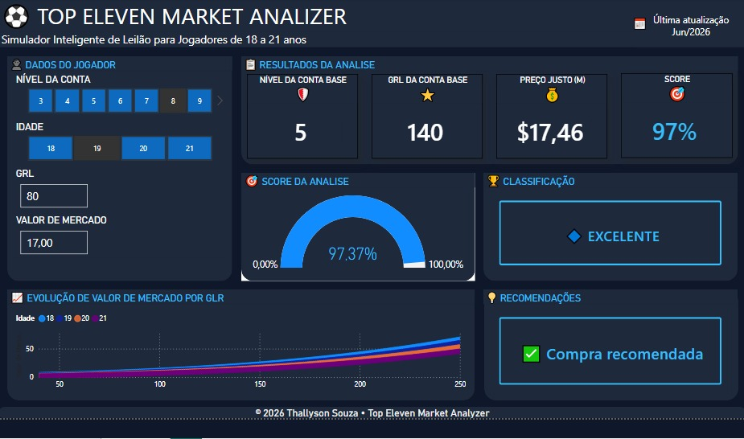
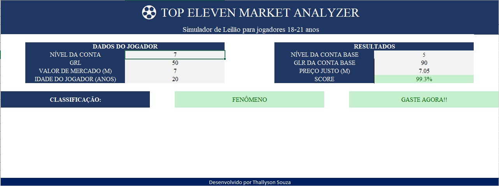

# Top Eleven Market Analyzer



## Overview

Top Eleven Market Analyzer is a data-driven solution developed to evaluate player market values and identify auction opportunities in the Top Eleven football management game.

The project combines Power BI dashboards and an Excel-based simulator to estimate fair player prices, compare market values, and support data-driven transfer decisions.

---

## Project Goals

This project was created to:

- Analyze player market behavior.
- Estimate fair market values.
- Identify undervalued and overvalued players.
- Support auction decision-making.
- Apply Business Intelligence concepts in a real-world scenario.

---

## Power BI Dashboard

The dashboard provides interactive analysis of player valuation patterns based on:

- Player Age
- Overall Rating (GRL)
- Market Value
- Account Level
- Market Trends

### Key Features

Interactive visualizations
Dynamic filtering
Market value analysis
Player comparison
Performance indicators
Data-driven insights

---

## Excel Auction Simulator

The Excel simulator allows users to evaluate potential auction purchases using a scoring methodology developed from historical player data.

### Inputs

- Account Level
- Player GRL
- Market Value
- Player Age

### Outputs

- Base Account Level
- Reference GRL
- Fair Price Estimation
- Opportunity Score
- Purchase Recommendation

### Example Classifications

| Score | Recommendation |
|---------|----------------|
| Above 100% | Excellent Opportunity |
| 90% - 100% | Good Purchase |
| 80% - 90% | Evaluate Carefully |
| Below 80% | Avoid |

---

## Technologies Used

- Microsoft Power BI
- Microsoft Excel
- DAX
- Power Query
- Data Modeling
- Data Visualization

---

## Repository Structure

```text
.
├── TopElevenMarketAnalyzer.pbix
├── Base_Dados.xlsx
├── dashboard.jpeg
├── excel.jpeg
└── README.md
```

---

## Screenshots

### Power BI Dashboard


### Excel Simulator



---

## Methodology

The valuation model was developed through market data analysis considering:

- Player age groups (18–21 years)
- Overall Rating (GRL)
- Market value behavior
- Account level differences

The resulting model estimates a player's fair value and calculates an opportunity score to assist decision-making during auctions.

---

## Business Value

This project demonstrates practical skills in:

- Business Intelligence
- Data Analysis
- Dashboard Development
- Excel Automation
- KPI Design
- Decision Support Systems

---

## Author

### Thallyson Aparecido de Souza

Electronic and Telecommunications Engineer

Skills:

- Power BI
- DAX
- Power Query
- Excel
- Data Analysis
- Business Intelligence

GitHub:
https://github.com/thallysonsouza

---

## 📌 Status

✅ Completed

Version 1.0
